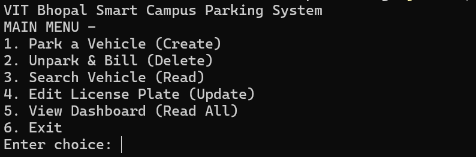
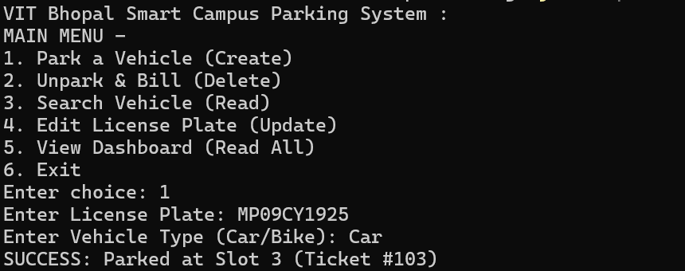
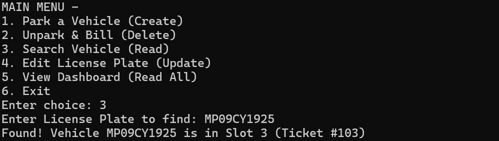
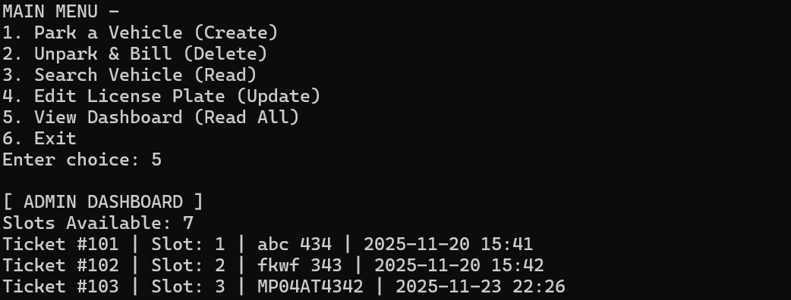

# Smart Campus Parking System

 

## 📖 Project Overview
The **Smart Campus Parking System** is a Java based application which is  designed to digitalize and automate the management of parking slots in the university. [cite_start]It solves the problem of tracking the vehicles in the parking slot manually by providing an interface for vehicle entry, exit, fee calculation, and monitoring[cite: 10, 89, 90].

[cite_start]This project shows the practical usage of concepts of **Object-Oriented Programming (OOP)** such as Inheritance , Polymorphism , Abstraction and Encapsulation in solving real world problems.[cite: 8, 51].

---

## ✨ Key Features
Here are the main features I implemented based on the project requirements:

**1. Vehicle Entry**

Auto Assignment of free Slots: The system finds the nearest free slots automatically so that it doesn't need to be checked manually.

Vehicle Details: The license type an vehicle type are recorded upon arrival of the vehicle.

Automatic Validation: Validation of license plates ensures that no duplicate vehicles are parked. 

**2. Exit & Billing**

Automatic Billing: The system calculates the total fee based on the type of vehicle parked and duration of parking .

Different Rates: Different pricing model is used according to the type of vehicle to ensure fair pricing .

Receipts: It prints a simple summary of the billing is displaye to the user after checkout.

### 3. Admin Dashboard
* **Occupancy Tracking:** Provides Real time tracking of occupied and available slots.
* **Revenue Reports:** Tracks the total earnings for the session.
* **Reset Capability:** Allows admins to reset so to clear data for a new day.

---

## 🛠️ Technologies & Tools Used
Language: Java (JDK 17) - Chosen for its strong OOP support.

IDE: Eclipse - Used for writing and debugging the code.

Version Control: Git & GitHub - Used to track changes and manage file history.

Data Storage: Made use of Text Files to maintain the data and Java Collections (ArrayList/HashMap) for fast data processing.

---

## ⚙️ OOP Concepts Implemented
* **Inheritance:** A Parent class `Vehicle` is created which is then extended by `Car` and `Bike` classes so that they can acquire the common attributes.
* **Polymorphism:** Both car and bike classes provide their own implementation to the `calculateFee()` method by overriding it to calucate the total fees according to the vehicle type
* **Encapsulation:** All data fields are made private and accessible only with the use of Getter and Setter methods.
* **Abstraction:** Interfaces are used for the Parking Service.
* [cite_start]**Exception Handling:** Custom exceptions like `ParkingLotFullException` and `InvalidTicketException` are created to tell the user about what is causing the error .[cite: 41].

---

## 🚀 Steps to Install & Run
[cite_start]Follow the given steps to set up the project on your local machine[cite: 94]:

1.  **Clone the Repository**
    ```bash
    git clone [https://github.com/YOUR_USERNAME/SmartCampusParking.git](https://github.com/YOUR_USERNAME/SmartCampusParking.git)
    ```

2.  **Navigate to the Directory**
    ```bash
    cd SmartCampusParking
    ```

3.  **Compile the Code**
    ```bash
    javac -d bin src/com/campus/parking/main/Main.java
    ```

4.  **Run the Application**
    ```bash
    java -cp bin com.campus.parking.main.Main
    ```

---

## 🧪 Instructions for Testing
[cite_start]Use the following test cases to verify the working of the features [cite: 95]:

| Test Case | Action | Expected Output |
| :--- | :--- | :--- |
| **Park Vehicle** | Select Option 1 -> Enter "CAR123" -> Select "Car" | System assigns a Slot ID (e.g., C-01) and confirms entry. |
| **Duplicate Entry** | Try to park "CAR123" again | Error Message: "Vehicle already exists in the lot." |
| **Exit Vehicle** | Select Option 2 -> Enter "CAR123" | System shows parking duration and calculated fee. |
| **Admin View** | Select Option 3 -> Enter Password | Shows Total Vehicles: 0, Total Revenue: [Fee Amount]. |

---

## 📸 Screenshots









---

## 👤 Author
* **Name:** Kavish Kalra
* **Registration no. :** 24BSA10034
